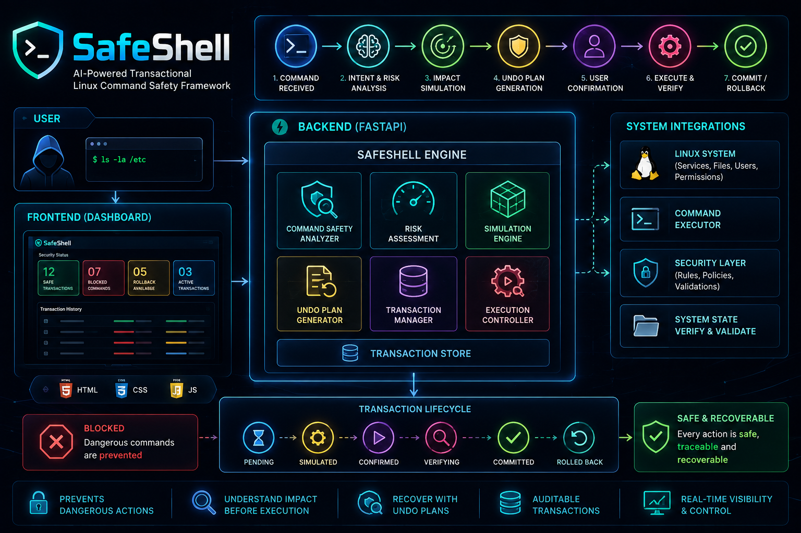

# SafeShell

## AI-Powered Transactional Linux Command Safety Framework

SafeShell is an application-level Linux command safety framework developed for the **Next-Gen Kernel Hackathon — Trusted Computing and Embedded Security** track.

### Hackathon Problem Statement

**Track 2 — Problem Statement 3**

> **SafeShell: A Transactional Command Execution Framework with AI-Generated Undo Plans and Simulation-Based Safety Guarantees**

SafeShell introduces a safety layer between a user and Linux command execution. Instead of executing a command immediately, the framework analyzes the request, assesses risk, simulates potential impact, prepares an undo/rollback plan, requests confirmation, and then moves through execution, verification, and commit or rollback.

```text
User Command
     ↓
Intent Analysis
     ↓
Risk Analysis
     ↓
Impact Simulation
     ↓
Undo Plan
     ↓
User Confirmation
     ↓
Execution
     ↓
Verification
     ↓
Commit / Rollback
```

---

## Key Features

### Command Risk Analysis
Deterministic command-safety rules identify potentially dangerous Linux operations and classify them as LOW, MEDIUM, HIGH, CRITICAL, or BLOCKED.

### Pre-Execution Simulation
SafeShell presents predicted impact including files, services, configuration changes, affected resources, and estimated system impact before execution.

### Undo and Rollback Planning
Each supported transaction has a recovery strategy and rollback status.

### Transaction Lifecycle
Transactions move through states such as:

```text
ANALYZING
SIMULATED
AWAITING_CONFIRMATION
EXECUTING
VERIFYING
COMMITTED
ROLLED_BACK
BLOCKED
FAILED
```

### Dangerous Command Blocking
Dangerous operations such as recursive deletion and unsafe system-wide permission changes are simulated and blocked in Demo Mode rather than executed on the host.

### Transaction History
Transactions are recorded with transaction ID, command, risk, status, and rollback information.

### Interactive Security Filters
The dashboard provides filters for:
- Safe Transactions
- Blocked Commands
- Rollback Available
- Active Transactions

### Deterministic Demo Mode
Predefined scenarios provide repeatable results without requiring an external LLM, internet connectivity, or destructive system operations.

---

# Demo Scenarios

| Scenario | Example Command | Risk | Expected Result |
|---|---|---:|---|
| Dangerous File Deletion | `rm -rf /tmp/*` | HIGH | BLOCKED |
| Service Restart | `systemctl restart nginx` | MEDIUM | COMMITTED / ROLLED_BACK |
| Permission Change | `chmod +x /opt/app/script.sh` | LOW | COMMITTED |
| Configuration Modification | `nano /etc/safeshell/app.conf` | MEDIUM | Transaction + rollback |
| Package Installation | `apt install nginx` | MEDIUM | Transaction simulation |
| Dangerous Privilege Escalation | `chmod -R 777 /` | CRITICAL | BLOCKED |
| Successful Transaction | Log cleanup example | LOW | COMMITTED |

---

# Architecture


```text
                         SafeShell Frontend
                      HTML / CSS / JavaScript
                                │
                                ▼
                         FastAPI REST API
                       /api/safeshell/*
                                │
                                ▼
                       SafeShell Engine
                                │
                 ┌──────────────┴──────────────┐
                 ▼                             ▼
        Command Safety Analyzer       Simulation / Undo Engine
        Deterministic Rules           Predefined Demo Scenarios
                 │                             │
                 └──────────────┬──────────────┘
                                ▼
                      Transaction State Machine
                                │
                                ▼
                     Execute / Verify / Rollback
```

**Current scope:** application-level prototype. The current implementation does not modify the Linux kernel.

---

# Project Structure

```text
safeshell/
├── backend/
│   ├── app/
│   │   ├── main.py
│   │   ├── config.py
│   │   ├── database.py
│   │   ├── routes/
│   │   │   ├── assistant.py
│   │   │   ├── commands.py
│   │   │   ├── fixes.py
│   │   │   ├── health.py
│   │   │   ├── safeshell.py
│   │   │   └── system.py
│   │   └── services/
│   │       ├── command_safety.py
│   │       ├── command_executor.py
│   │       ├── command_console.py
│   │       ├── execution_store.py
│   │       ├── fix_engine.py
│   │       └── safeshell_engine.py
│   ├── requirements.txt
│   └── .env.example
│
├── frontend/
│   ├── index.html
│   ├── safeshell.html
│   ├── script.js
│   ├── script1.js
│   ├── style.css
│   └── vendor/
│
├── docs/
├── README.md
└── LICENSE
```

---

# Technology Stack

**Backend:** Python 3.12+, FastAPI, Uvicorn, Pydantic Settings, psutil, HTTPX, python-dotenv

**Frontend:** HTML5, CSS3, JavaScript, JetBrains Mono, Inter, Chart.js assets

**Security Layer:** deterministic command safety analysis, risk classification, pre-execution simulation, transaction state machine, explicit confirmation, undo/rollback representation, transaction history, and security filtering.

---

# Installation

## Prerequisites

- Linux
- Python 3.12+ or compatible Python 3
- pip
- Git

## Clone

```bash
git clone <YOUR_GITHUB_REPOSITORY_URL>
cd safeshell
```

## Create virtual environment

```bash
cd backend
python3 -m venv venv
```

## Activate

```bash
source venv/bin/activate
```

## Install dependencies

```bash
python -m pip install --upgrade pip
pip install -r requirements.txt
```

---

# Running SafeShell

## Backend

From `backend`:

```bash
source venv/bin/activate
uvicorn app.main:app --host 0.0.0.0 --port 8000
```

Backend:

```text
http://localhost:8000
```

API documentation:

```text
http://localhost:8000/docs
```

## Frontend

Open a second terminal:

```bash
cd frontend
python3 -m http.server 5500
```

Open:

```text
http://localhost:5500/safeshell.html
```

---

# SafeShell API

| Method | Endpoint | Purpose |
|---|---|---|
| GET | `/api/safeshell/scenarios` | List predefined scenarios |
| POST | `/api/safeshell/analyze` | Analyze command intent and risk |
| POST | `/api/safeshell/simulate` | Simulate command impact |
| POST | `/api/safeshell/execute` | Complete a confirmed demo transaction |
| POST | `/api/safeshell/rollback` | Roll back a transaction |
| GET | `/api/safeshell/transactions` | Retrieve transaction history |
| GET | `/api/safeshell/transactions/{id}` | Retrieve a transaction |
| GET | `/api/safeshell/status` | Retrieve security counters |

Example:

```bash
curl http://localhost:8000/api/safeshell/scenarios
```

```bash
curl -X POST http://localhost:8000/api/safeshell/analyze   -H "Content-Type: application/json"   -d '{"command":"Delete all temporary files"}'
```

```bash
curl http://localhost:8000/api/safeshell/transactions
```

---

# Recommended Hackathon Demo

### Dangerous File Deletion

```text
rm -rf /tmp/*
        ↓
HIGH RISK
        ↓
Impact Simulation
        ↓
Undo Plan
        ↓
BLOCKED
```

The destructive command is not executed on the host.

### Service Restart

```text
systemctl restart nginx
        ↓
Analyze
        ↓
Simulate
        ↓
Undo Plan
        ↓
Confirm
        ↓
Execute
        ↓
Verify
        ↓
COMMITTED
```

### Rollback

```text
COMMITTED
    ↓
ROLLBACK
    ↓
ROLLED_BACK
```

### Audit

Show Transaction History and the four filters:

```text
Safe Transactions
Blocked Commands
Rollback Available
Active Transactions
```

---

# Security Model

The core principle is:

> **Do not execute an uncertain Linux operation blindly. Understand it, simulate its impact, prepare recovery, obtain confirmation, execute under transaction control, and verify the result.**

The prototype separates intent, risk analysis, simulation, recovery planning, execution control, verification, and rollback.

---

# Current Prototype Limitations

This project is optimized for a reliable hackathon demonstration.

- Predefined scenarios use deterministic risk reasoning, simulation results, undo plans, and outcomes.
- The implementation is application-level and does not modify the Linux kernel.
- Dangerous operations are simulated rather than executed in Demo Mode.
- Rollback demonstrates the transaction recovery workflow rather than providing production-grade filesystem snapshot restoration.
- The demo does not require a live external LLM.
- SafeShell demo transaction state is maintained by the running application process; a production version should use durable persistent storage.

---

# Future Enhancements

- Persistent transaction database
- Real filesystem snapshots
- OverlayFS sandbox execution
- Linux namespaces
- cgroups resource controls
- seccomp restrictions
- eBPF-based monitoring
- Dependency-aware rollback
- Real command impact analysis
- LLM-generated intent and undo plans
- Deterministic validation of LLM output
- Cryptographically protected audit logs
- Policy-as-code command authorization
- Privilege separation
- Stronger kernel-level enforcement

---

# Hackathon Alignment

| Requirement | SafeShell Implementation |
|---|---|
| Transactional command execution | Transaction IDs and lifecycle states |
| AI-assisted operation | Intent/security analysis architecture |
| Undo plans | Deterministic undo-plan engine |
| Simulation | Pre-execution impact simulation |
| Safety guarantees | Deterministic risk rules and blocking |
| User confirmation | Explicit transaction confirmation |
| Verification | Post-execution verification state |
| Rollback | Rollback transaction workflow |
| Auditability | Transaction history |
| Repeatable demonstration | Deterministic Demo Mode |

The current implementation is intentionally presented as a prototype rather than claiming production-grade kernel enforcement.

---

# Security Notice

SafeShell is a hackathon prototype. Demo Mode intentionally simulates dangerous operations. Do not treat the current implementation as a production security boundary.

A production implementation should undergo extensive security testing, privilege isolation, sandbox validation, rollback validation, and adversarial testing.

---

# License

See the `LICENSE` file included in this repository.

---

## SafeShell

**AI-Powered Transactional Linux Command Safety Framework**

**Analyze → Simulate → Recover → Confirm → Execute → Verify → Rollback**

Built for the **Next-Gen Kernel Hackathon — Trusted Computing and Embedded Security** track.
